# IRIS FOR HEALTH - VALIDACION DE PERFILES

Si bien existen herramientas online a la hora que necesitamos validar 
algún desarrollo propio, que va a enviar recursos FHIR, a veces el teimpo 
de respuesta puede no ser el adecuado o no tenemos una conexión lo 
suficientemente estable mientras hacemos nuestro desarrollo. Cualquiera 
sea el escenario, siempre tenemos una herramienta adicional y acá presento 
la alternativa de usar IRIS for Health community para apoyarnos en el 
proceso de validar precisamente el avance de nuestro desarrollo.

Cuando nos enfrentamos a la necesidad de que nuestro desarrollo no sólo 
cumpla con el estándar FHIR sino que además responda a una definición 
particular de nuestro entorno, como por ejemplo una hisotria clínica 
compartida declarada como normativa por alguna entidad como un Ministerio 
de Salud, vamos a necesitar ir a la Guía de implementación que han 
publicado para este objetivo y desde allí estudiar esa guía y preparar 
nuestro desarrollo para que cumpla con las reglas de cada perfil que se 
debe intercambiar.

¿Y qué tal si nos traemos esa guía a nuestro entorno de desarrollo y luego 
aplicamos una validación local?

Para ellos vamos a necesitar:

Docker: de forma opcional, pues podrás iniciar una imagen con 
instrucciones contenidas en este repositorio (compose) que instalará adeás 
las dependencias para crear un proyecto SUSHI y la versión de jdk 
adecuada.

SUSHI, para poder crear una guía de implementación o replicar la publicada 
por la entidad a cargo.

IRIS for health para implementar un repositorio FHIR y que además conozca 
y valide nuestras peticiones en base a los perfiles que deseamos cumplir.

Lo primero que comparto son los algunos link de interés que pueden visitar 
y complementar la información contenida en este repositorio.

## Links de Interés

[FSH]: 
<Shorthand][https://build.fhir.org/ig/HL7/fhir-shorthand/reference.html> 
"FHIR Shorthand"

[FHIR Shorthand][FSH]: siendo una herramienta contenida en el propio 
estándar, podemos hacer uso de ella a la hora de definir nuestros propios 
perfiles o adaptar los declarados por algún estándar para que se ajusten a 
los requerimientos específicos del caso de uso que estemos implementando. 
El objetivo es hacer esta adaptación en línea con definiciones propias del 
estándar para no perder tiempo si luego nuestro desarrollo crece y 
requiere ser compartido más allá de nuestra propia implementación.

[install]: <https://fshschool.org/docs/sushi/installation/> "Instalación 
FSH"

[Instalación FSH][install]: La guía oficial de instalación de 
dependencias, esto es independiente si vamos a usar Windows, Linux u otro 
sistema operativo; esto debería ser transparente pues lo primero será 
resolver tener instalado NodeJS.

[validatorcli]: 
<https://confluence.hl7.org/display/FHIR/Using+the+FHIR+Validator> 
"Validador FHIR"

[Cliente validador FHIR][validatorcli]: Una herramienta abierta, en Java, 
para validar archivos en formato de perfil FHIR (json normalmente).

## Pasos de Implementar esta guía

### Clonar este repositorio
Lo primero que recomiendo es que clones este repositorio para tener los 
archivos y dependencias en seguida en una carpeta loca:

```bash
docker clone https://github.com/fakriman/IRIS-FHIR-Profile-Validation.git
cd IRIS-FHIR-Profile-Validation 
```

### IRIS for Health.

Vamos a utilizar la versión IRIS for Health Community 2022.1.2.574.0. Esta 
versión puede ser descargada desde el sitio de desarrolladores

Hay dos formas de obtenerla:

Desde el sitio de evaluación para la comunidad: 
[https://evaluation.intersystems.com/Eval/](https://evaluation.intersystems.com/Eval/)

[extension]: 
<https://hub.docker.com/extensions/caretdev/intersystems-extension> 
"InterSystems Docker extension"

O si contamos con Docker en nuestro equipo, podemos instalar la [extensión 
InterSystems][extension]:

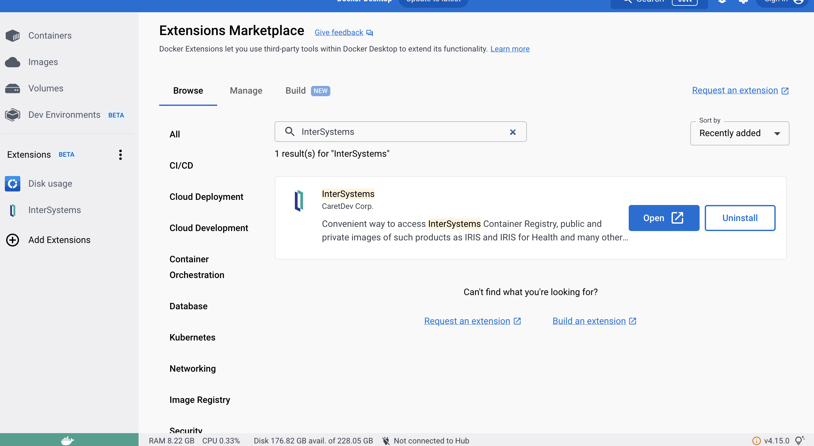


Si optas por la instalación, sólo es necesario seguir la guía de 
instalación que normalmente será muy automática (next, next, next...) y 
luego cargar manualmente las clases y componentes requeridos para poder 
validar perfiles FHIR desde IRIS.

Si optas por hacerlo con docker, puedes iniciar directamente la imagen, 
con 2 pre-requisitos si no quieres modificar el archivo fhirwebinar.yml, 
es que por comodidad en mi caso, toda imagen que uso desde Docker con 
IRIS, la hago parte de la red "irisenv-net", porque así de forma directa 
están todas comunicadas entre sí compartiendo recursos como un IAM o un 
Webgateway. Entonces lo primero sería crear esta red con el comando:

```bash
docker network create irisenv-net
```

Podemos validar la existencia de la red:

```bash
docker network list
```

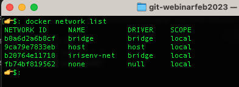


Lo segundo, es que si miras el archivo ***fhirwebinar.yml*** hará uso 
compartido de la carpeta "shared", entonces, asegúrate de que Docker tiene 
acceso a la ruta donde dejes este repositorio y podrá compartirlo con las 
imagenes que vas a usar:

Recursos Docker:

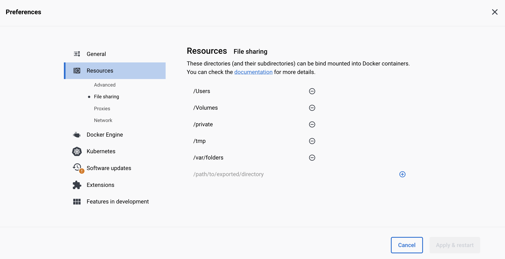

El archivo YML:

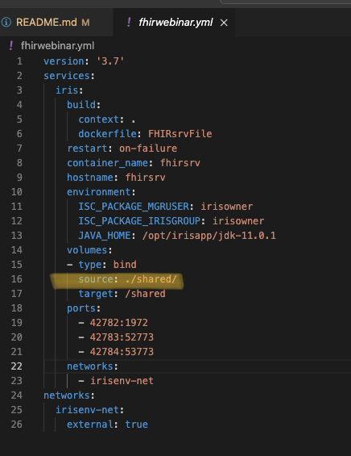

Con estos dos pasos ya puedes iniciar la imagen:

```bash
docker-compose -f fhirwebinar.yml up -d
```

Este proceso instalará la imagen de IRIS for Health e instalará algunas 
dependencias:

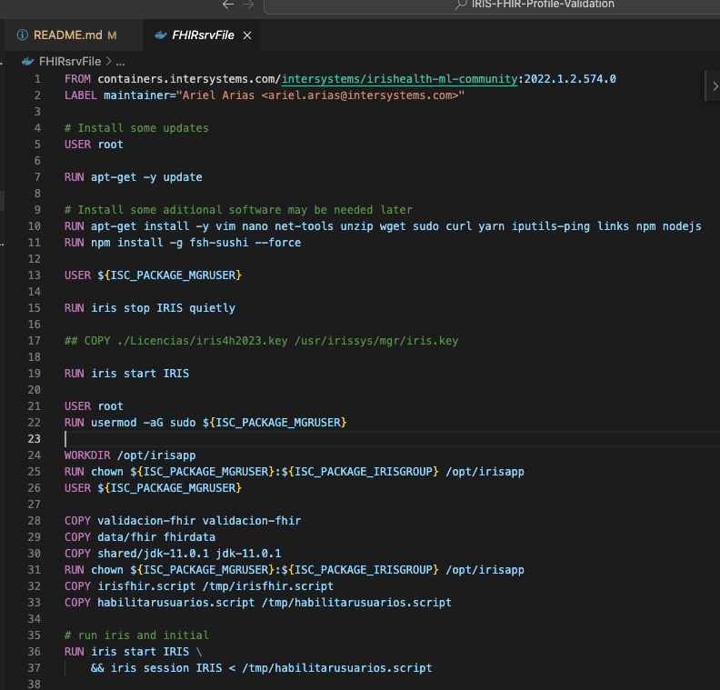

El proceso será relativamente rápido dependiendo de la conexión a Internet 
ya que actualizará Ubuntu e instalará estas dependencias.

Si todo va bien podemos ver nuestro servidor ya en ejecución y acceder vía 
terminal (bash) y al portal de gestión de IRIS:

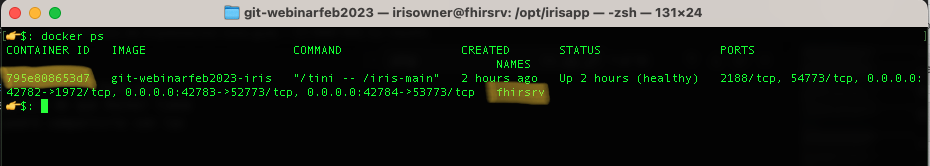

Entonces!, vamos a configurar IRIS con lo que hace falta.

## Configurar IRIS

[irisportal]:<http://localhost:42783/csp/sys/UtilHome.csp> "Portal de 
gestión IRIS"

Ingresamos al [portal de gestión][irisportal] (superuser // SYS):


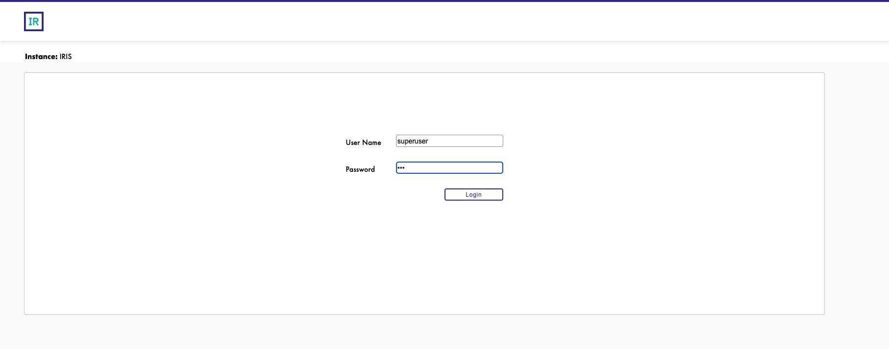

[about]: <http://localhost:42783/csp/sys/_CSP.UI.Portal.About.zen> "About 
IRIS"

Por defecto este portal estará en inglés (idioma del sistema operativo) 
por lo que si prefieres puedes ir y cambiarlo a español en 
"[About][about]":

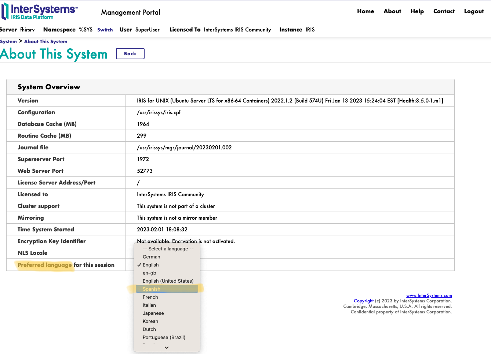

### Servidores de idioma externos

[javaserver]: 
<http://localhost:42783/csp/sys/mgr/%25CSP.UI.Portal.ExternalLanguageServers.zen?$NAMESPACE=%25SYS> 
"Configurar Java Server"

Para utilizar desde IRIS el **validator_cli** (java) vamos a necesitar que 
IRIS ejecute el [%JAVA_Server][javaserver], por lo que vamos a 
configurarlo con los siguientes datos:

| Parámetro | Valor |
|-----------|-------|
| Class path | /opt/irisapp/validacion-fhir/lib/JavaValidatorFacade.jar:/opt/irisapp/validacion-fhir/lib/validator_cli.jar |
| Java Home Directory | /opt/irisapp/jdk-11.0.1/ |

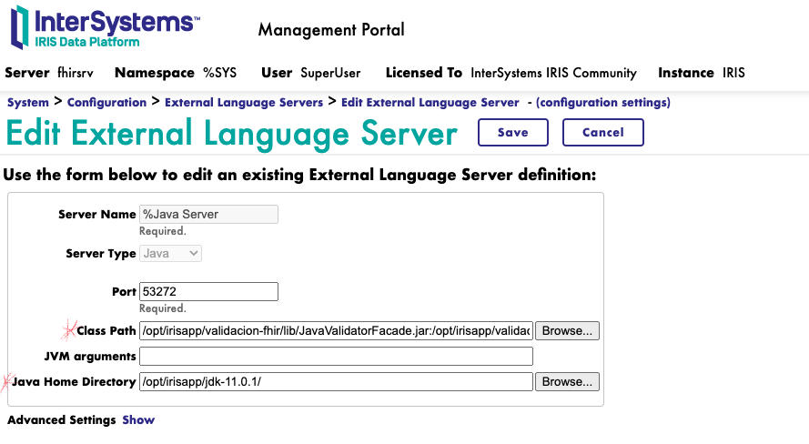

## Iniciar un Repositorio FHIR

En el proceso de inicio de la imagen IRIS, se copió un script que nos 
facilitará el proceso de iniciar y configurar un servidor FHIR (y 
repositorio), por lo que vamos a ejecutar directamente ese script (si haz 
ido por la alternativa de docker) o puedes revisar el script y adaptarlo 
para ejecución desde otro sistema operativo o ubicación de los archivos 
que vamos a requerir.

### Desde Docker

Iniciamos una sesión directamente en la imagen docker:


```bash
docker exec -it fhirsrv bash
```
**Nota**: es probable que la primera vez que iniciamos esta sesión vía 
terminal, nos aparece un mensaje de cómo ejecutar "sudo", esto porque el 
script de inicio habilitó al ***irisowner*** como superusuario.


Ejecutamos el script:

```bash
iris session iris < /tmp/irisfhir.script 
```

El script: 

```
zn "%SYS"
Do ##class(Security.Users).UnExpireUserPasswords("*")

zn "HSLIB"
set namespace="FHIR"
Set appKey = "/fhir/r4"
Set strategyClass = "WebinarFeb.ValidationInteractionsStrategy"
Set metadataConfigKey = $lb("hl7.fhir.r4.core@4.0.1")

//Install a Foundation namespace and change to it
Do ##class(HS.HC.Util.Installer).InstallFoundation(namespace)
zn namespace

// Install elements that are required for a FHIR-enabled namespace
Do ##class(HS.FHIRServer.Installer).InstallNamespace()

zn namespace
// Load custom clases for Validation and implementation
do $System.OBJ.ImportDir("/opt/irisapp/validacion-fhir/src", "*.cls", 
"cuk",, 1)
// Configure some Registry Parameters
do 
$System.OBJ.Load("/opt/irisapp/validacion-fhir/conf/HS-Registry-Config.xml")
// do 
$System.OBJ.Load("/opt/irisapp/validacion-fhir/conf/HSFHIR-Registry-Config.xml")

zn namespace
// Install an instance of a FHIR Service into the current namespace
Do ##class(HS.FHIRServer.Installer).InstallInstance(appKey, strategyClass, 
metadataConfigKey,"",0)

zn namespace
set myrepo = ##class(HS.FHIRServer.Repo).%OpenId(1)
set myrepo.strategyClass = "WebinarFeb.ValidationInteractionsStrategy" 
Do myrepo.%Save()

set strategy = 
##class(HS.FHIRServer.API.InteractionsStrategy).GetStrategyForEndpoint(appKey)
set config = strategy.GetServiceConfigData()
set config.DebugMode = 6
set config.InteractionsStrategyClass = 
"WebinarFeb.ValidationInteractionsStrategy"
do strategy.SaveServiceConfigData(config)

halt
```

[registry]: 
<http://localhost:42783/csp/healthshare/fhir/HS.UI.Registry.Configuration.cls> 
"Configurar parámetros en registry"

Con este script ya contamos con un servidor FHIR en nuestra imagen de 
IRIS, por lo que podemos utilizarlo. Pero para el propósito de validar 
perfiles en particular, necesitamos configurar algunos parámetros en 
"[Registry][registry]".

Asegurar que se configura según los parámetros:

| Key | Value |
|-----|-------|
| /FHIR/Validation/JavaGatewayPort | 53272|
| /FHIR/Validation/JavaGatewayServer | 127.0.0.1 |
| /FHIR/Validation/ProfileLocation | 
/opt/irisapp/validacion-fhir/IG/resources |
| /FHIR/Validation/SkipIfNoProfile | 1 |
| /FHIR/Validation/TerminologyServer |  |

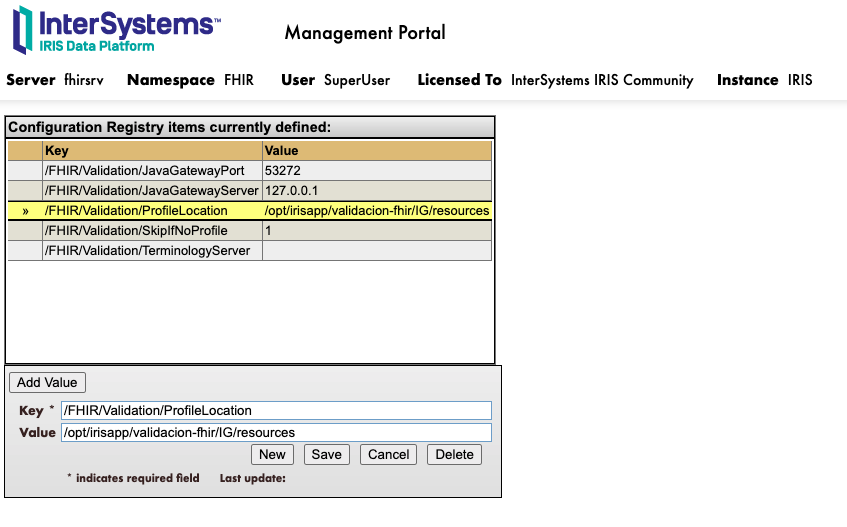


[hl7cl]: <https://hl7chile.cl/fhir/ig/CoreCL/1.7.0/> "Guía de 
implementación 1.7"

Ya con estos pasos estamos en condiciones de validar un perfil. En este 
ejemplo, se ha cargado en la carpeta 
**/opt/irisapp/validacion-fhir/IG/resources** los archivos generados desde 
un proyecto SUSHI que contiene la [guía de implementación 1.7 de HL7 
Chile][hl7cl].

Entonces, si lo necesario es crear o implementar una IG propia, puedes 
crear un proyecto SUHI en la imagen IRIS que hemos montado, y para que 
IRIS utilice esa guía, asegúrate de darle la ruta correcta a la carpeta de 
recursos en el "[Configuration Registry][registry]", específicamente a la 
clave: ***/FHIR/Validation/ProfileLocation***

La primera vez que se intente validar un perfil, tomará tiempo y 
probablemente obtengamos un **"timeout"** pues, dentro de las tareas que 
realizará IRIS, es crear las clases necesarias para la llamada al 
validator_cli, generando el package "java" en el namespace FHIR que se 
creó con el script.

Pero no es problema, podemos reintentar la validación y ya para la segunda 
ejecución y posteriores deberíamos obtener la respuesta detallada, ya sea 
un OK o detalle de errores.

# RESOLUCION DE PROBLEMAS

La aplicación que se ha creado */fhir/r4* se ha creado con el check de 
"Sin autenticar", para efecto de facilitar las pruebas. Por esto, es 
probable obtener un mensaje de error pues, el usuario ***"UnknownUser"*** 
no tiene privilegios para hacer uso del Gateway, entonces tendremos una 
respuesta similar a *"Operation requires %Gateway_Object:USE privilege"*:

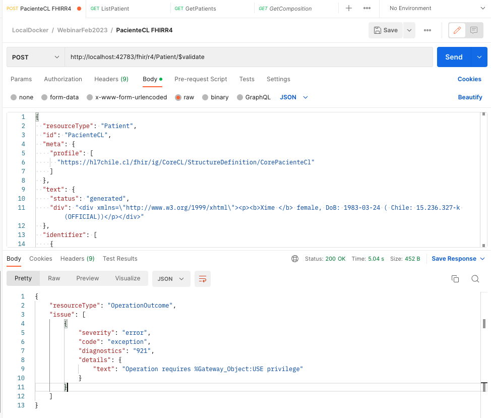

[irisresources]: <http://localhost:42783/csp/sys/sec/%25CSP.UI.Portal.Resources.zen?$NAMESPACE=FHIR&$NAMESPACE=FHIR> "Configurar recursos IRIS"

Por tratarse de un ambiente de desarrollo, lo más rápido es agregar al [recurso][irisresources] %Gateway_Object el permiso público de uso:

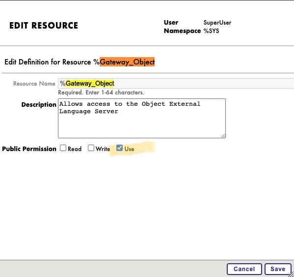